# HG Story

HG Story is an interactive narrative web application that translates research findings from my Master's thesis and a subsequent IEEE VIS publication into an accessible storytelling experience.

The application combines React, TypeScript, D3.js, and Framer Motion to communicate complex medical information through animated data visualization, illustration, and progressive disclosure. It explores how narrative design and interactive visualization can improve understanding and emotional engagement with health data.

---

## 💡 Motivation

This project transforms the original research prototypes into a production-ready web application.

The redesign introduces a modern React-based architecture, reusable visualization components, and a refined narrative informed by participant feedback collected during the evaluation study.

The application combines both experimental story versions using a *Martini Glass* narrative structure, gradually transitioning from an individual, character-driven perspective to a generalized, data-driven view of Hyperemesis Gravidarum.

--- 

## ✨ Features

- Reusable React and TypeScript component architecture
- Interactive D3.js-based data visualizations
- Progressive disclosure and guided narrative flow
- Animated focus transitions for small-scale data patterns
- Illustration-driven UI with quote elements
- Particle effects integrated with SVG illustrations
- Iceberg metaphor for communicating visible and hidden aspects of disease experiences
- Responsive layout and accessible visual hierarchy

---

## 📖 Narrative Structure

### Narrative Introduction 
| | |
|---|---|
|  | 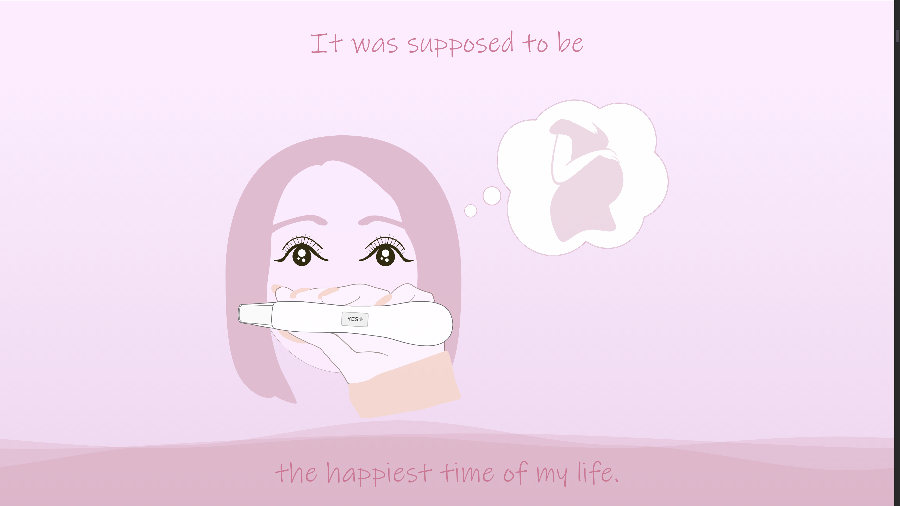 |
| Introducing the protagonist | Introducing the pregnancy topic |

### Conflict and Disease Experience
| | |
|---|---|
| 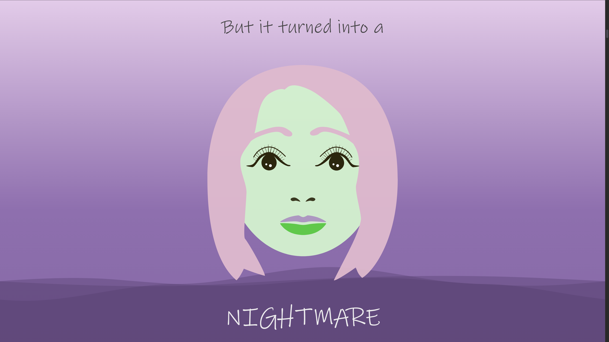 | 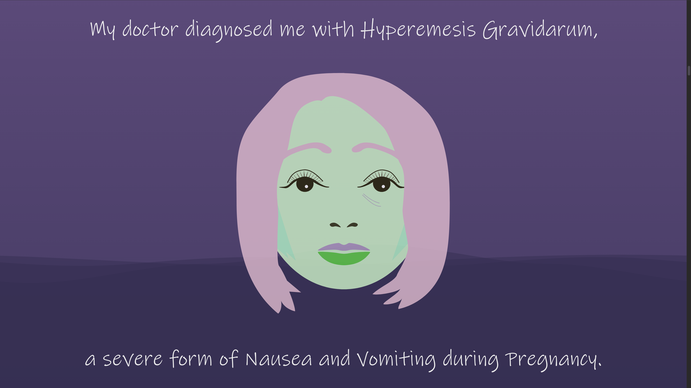 |
| Conveying emotional burden through illustration | Defining Hyperemsis Gravidarum (HG) |

### Explain the Disease and Prevalence
| | |
|---|---|
| 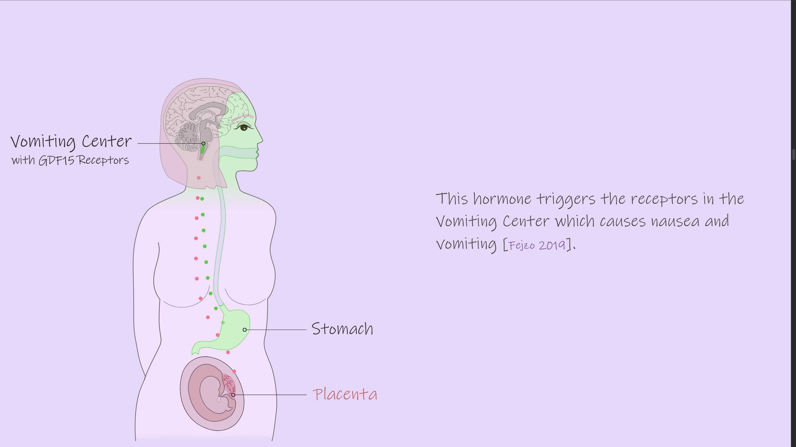 | 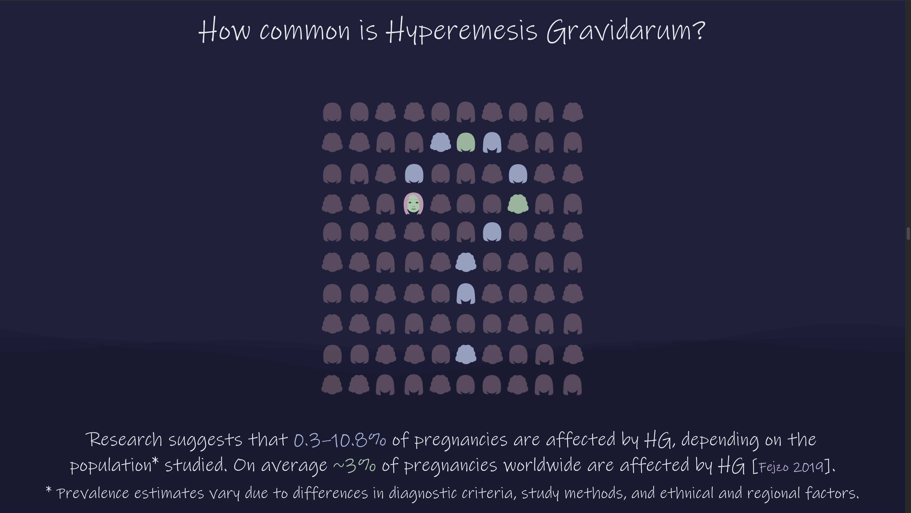 |
| Illustrating the biological mechanism | HG Prevalence |

### Data Visualization – Building Understanding
| | |
|---|---|
| 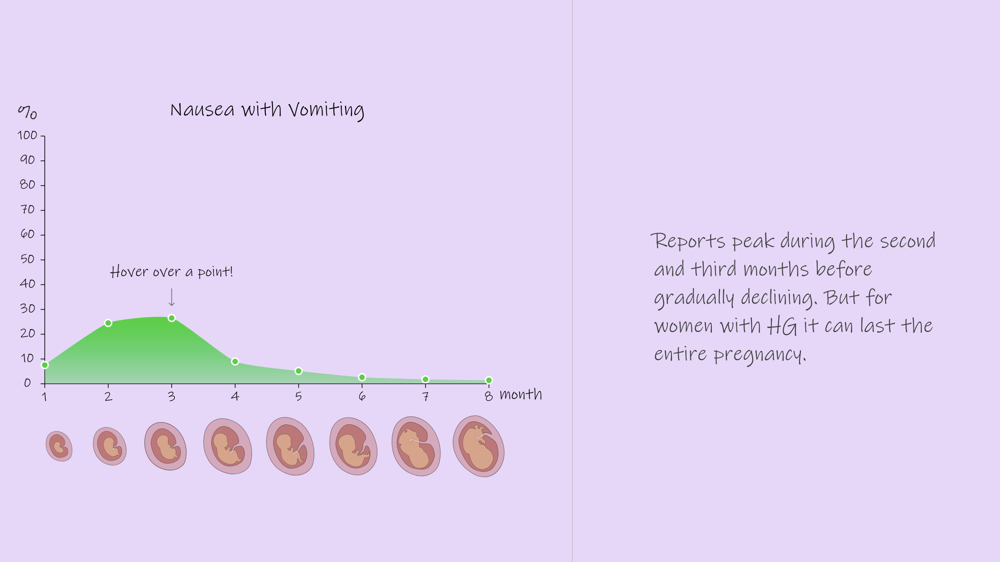 | 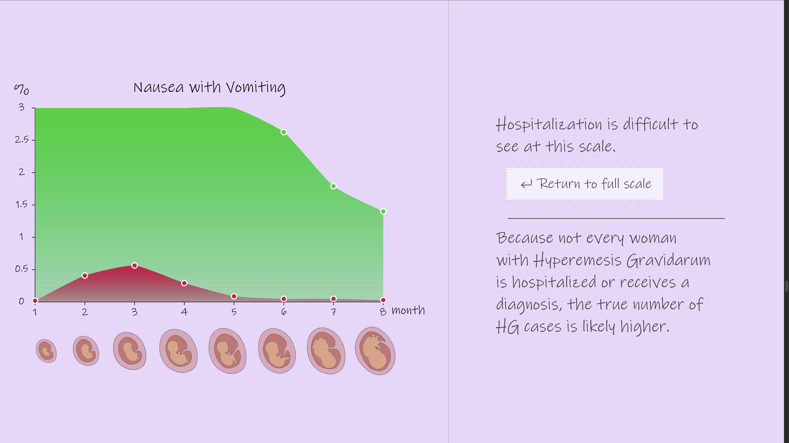 |
| Prevalence of nausea with vomiting | Animated focus on hospitalization rates |

### Data Visualization – Revealing Hidden Burden
| | |
|---|---|
| 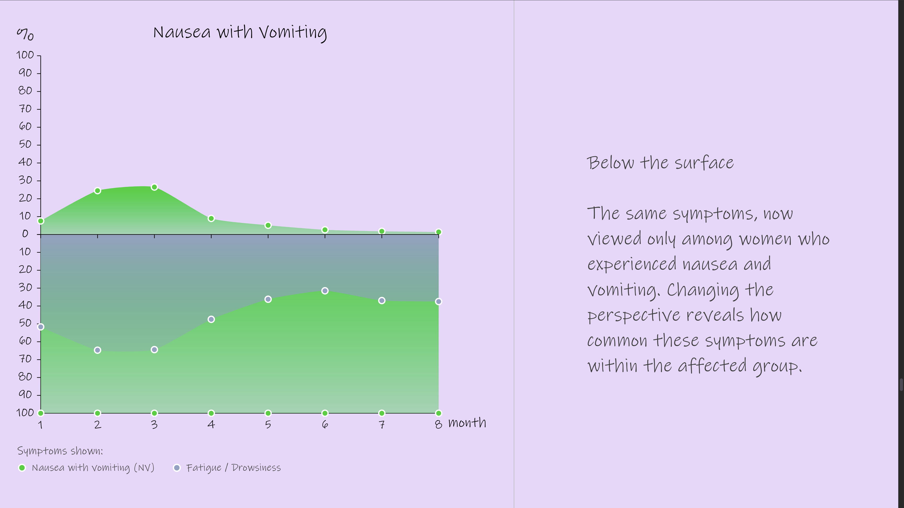 | 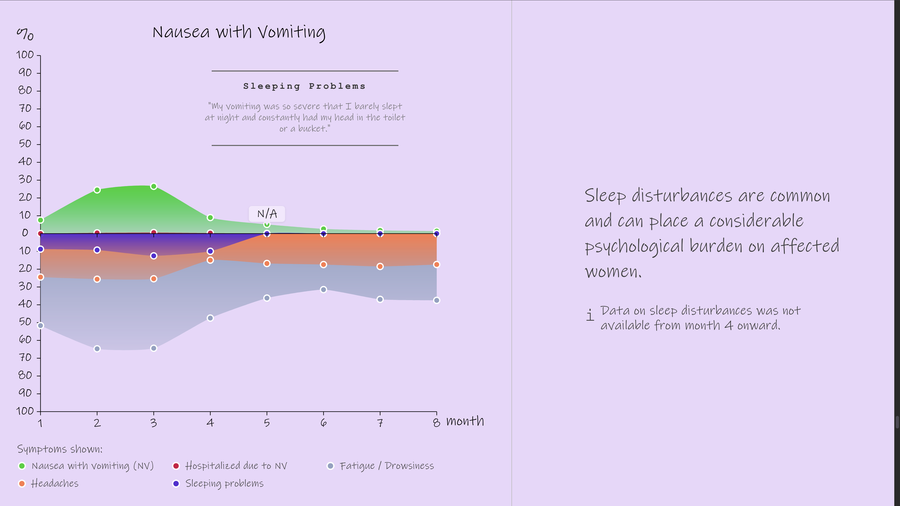 |
| Iceberg metaphor revealing hidden disease burden | Progressive disclosure of additional symptoms and patient experiences |

### Comparison and Resolution
| | |
| Individual Perspective | Collective Perspective |
|---|---|
| 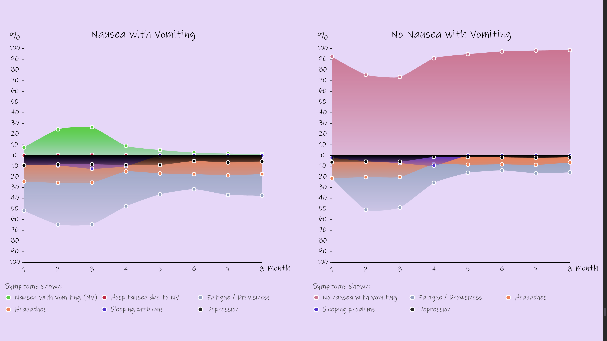 | 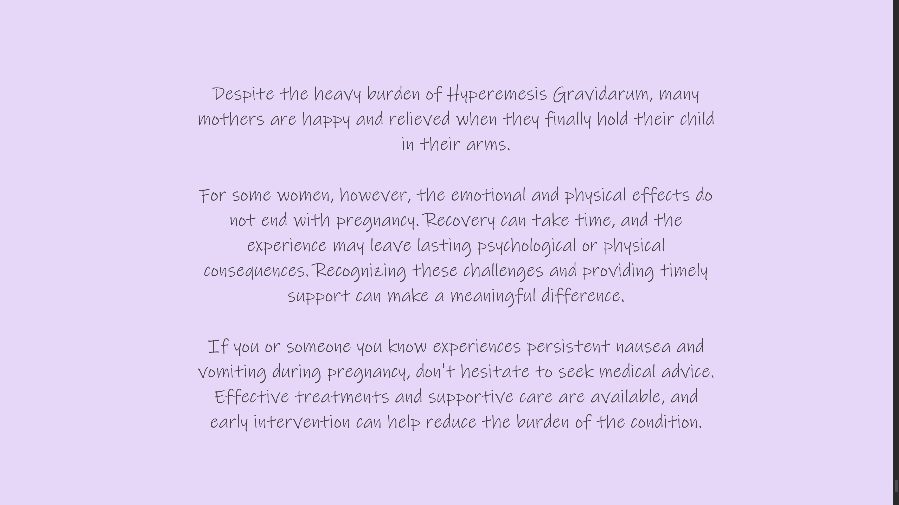 |
| Comparitive Visualization | Addtional explanation about HG beyond pregnancy |

---

🚀 Live Demo

View project: hg-story.vercel.app

- Live deployment with automatic updates via Vercel
- Real-time NOAA SWPC data integration

---

## 🧬 MoBa Data Availability

Data from the Norwegian Mother, Father and Child Cohort Study (MoBa) are managed by the Norwegian Institute of Public Health and are subject to ethical approval and GDPR regulations.

Due to participant privacy and ethical regulations, the original dataset cannot be redistributed publicly. Researchers seeking access must apply through the Norwegian health data services platform and obtain approval from the appropriate ethics committees and data owners.


Link: [MoBa – Norwegian Mother, Father and Child Cohort Study](https://www.fhi.no/en/ch/studies/moba/)

---

## 🛠 Tech Stack

- React
- TypeScript
- D3.js
- Framer Motion
- Vite
- HTML5
- CSS3

---

## 📊 Repository Contents
```
public/
└── data/
src/
├── assets/ 
    └── illustration/ 
├── components/ 
    ├── anatomy/ 
    ├── layout/ 
    └── visualization/ 
        └── annotation/ 

├── config/ 
├── font/ 
├── hooks/ 
├── scenes/ 
    ├── DataVisIntro/ 
    ├── DataVisualization/ 
    ├── ExplainDisease/ 
    ├── Intro/ 
    └── Outro/ 
├── styles/     
└── types/        

```
---

## 🎨 Design Notes

The visual design combines illustration, animation, and statistical graphics to communicate sensitive medical information without overwhelming the reader.

The project emphasizes:

- Accessible visualization design
- Readability and visual hierarchy
- Harmonious color palettes

---

🧠 What I Learned

This project gave me practical experience with:

- redesigning a web application according to user feedback
- modernizing research prototypes into production-ready applications
- designing reusable component architectures
- animating D3.js charts and UI components with Framer Motion
- integrating particle animations with SVG-based illustrations
- structuring frontend-heavy applications
- translating sensitive medical topics into accessible visual communication
- balancing aesthetics, readability, and usability

## 📚 Related Research

Master's Thesis:
[Emotional Engagement in Narrative Medical Visualization:
An Electrodermal Activity and Eye-Tracking Study](https://github.com/bbdataviz/Emotional-Engagement-in-Narrative-Medical-Visualization)

IEEE VIS / TVCG publication:
(once available)

---

## 📄 License

This project is licensed under the MIT License.
Copyright (c) 2026 Beatrice Budich
